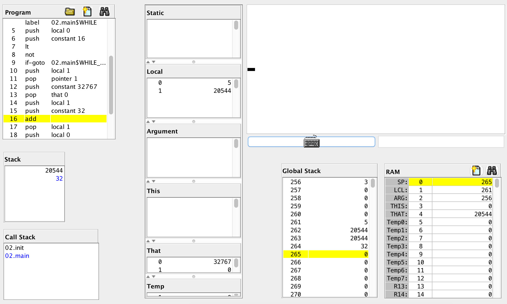

# Стековая виртуальная машина

## Закрасить один сегмент

The screen has 256 rows, with 512 pixels per row. So its display resolution is 512 x 256 – 512 columns, 256 rows.

The screen is linked to an 8K memory map, starting at RAM address 16384 (0x4000).

Код виртуальной машины:

```asm
push constant 16384   // смещение начала экрана, 16384
pop pointer 1         // база сегмента that
push constant 32767   // закрасить 16 пикселей целиком
pop that 4000         // примерно в середину экрана
```


## Закрасить квадрат

```asm
// var i := 0;
// var position := 16384 + 4000;
// while i < 16 {
//   screen[position] := 32767;
//   position := position + 32;
//   i := i + 1;
// }

function 02.init 0
call 02.main 0
label 02.init$LOOP
goto 02.init$LOOP

function 02.main 2
// var i := 0;
push constant 0
pop local 0

// var position := 16384 + 4000;
push constant 20384
pop local 1

// while i < 16 {
label WHILE
push local 0
push constant 16
lt
not
if-goto WHILE_END

//   screen[position] := 32767;
push local 1
pop pointer 1
push constant 32767
pop that 0

//   position := position + 32;
push local 1
push constant 32
add
pop local 1

//   i := i + 1;
push local 0
push constant 1
add
pop local 0

goto WHILE

label WHILE_END
return
```


