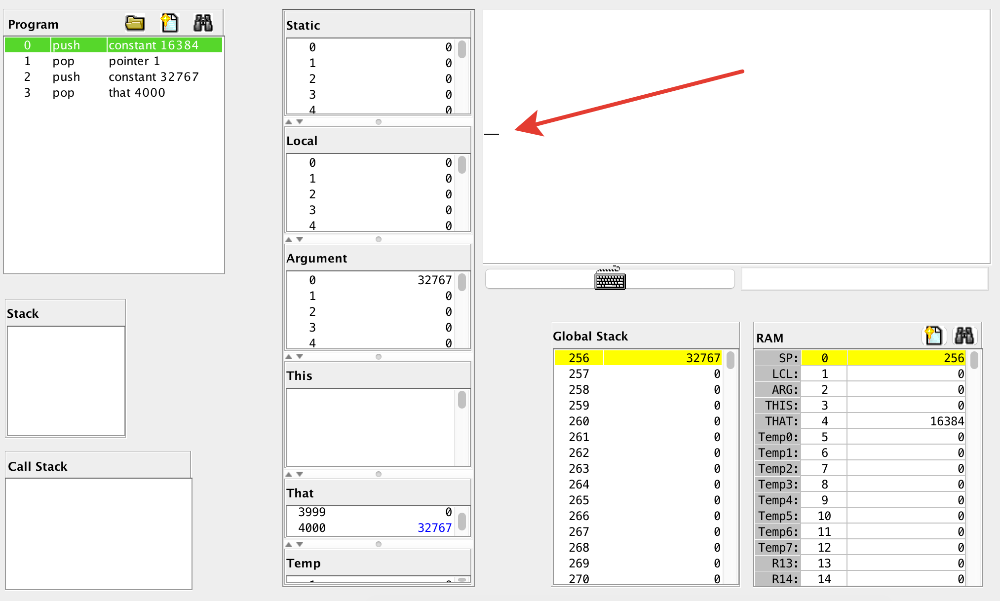

# Стековая виртуальная машина

## Закрасить один сегмент

The screen has 256 rows, with 512 pixels per row. So its display resolution is 512 x 256 – 512 columns, 256 rows.

The screen is linked to an 8K memory map, starting at RAM address 16384 (0x4000).

Код виртуальной машины:

```asm
push constant 16384   // смещение начала экрана, 16384
pop pointer 1         // база сегмента that
push constant 32767   // закрасить 16 пикселей целиком
pop that 4000         // примерно в середину экрана
```



**translator.py**

```python
CODE = '''
push constant 16384   // смещение начала экрана, 16384
pop pointer 1         // база сегмента that
push constant 32767   // закрасить 16 пикселей целиком
pop that 4000         // примерно в середину экрана
'''.strip()

def emit(instructions):
    for line in instructions.split(', '):
        print(line)

def pop_stack_to_d():
    emit('@SP, M=M-1, A=M, D=M')

def init_stack():
    emit('@256, D=A, @SP, M=D')

init_stack()

for line in CODE.split('\n'):
    if '//' in line:
        line = line.split('//')[0]
    command, *args = line.strip().split()
    if command == 'push':
        segment, offset = args
        if segment == 'constant':
            emit('@{0}, D=A, @SP, A=M, M=D, @SP, M=M+1'.format(offset))
    elif command == 'pop':
        segment, offset = args
        if segment == 'pointer':
            pop_stack_to_d()
            emit('@{}, M=D'.format(['THIS', 'THAT'][int(offset)]))
        elif segment == 'that':
            # *(*THAT + 4000) := **SP

            # THAT == 4
            # *THAT == 16384
            # D := *THAT + 4000 == 20384
            emit('@{0}, D=M, @{1}, D=A+D'.format(segment.upper(), offset))

            # *R13 := D
            emit('@R13, M=D')

            # SP == 0
            # *SP == 256
            # D := **SP == 32767
            pop_stack_to_d()

            # **R13 := D
            emit('@R13, A=M, M=D')
```

**output.asm**
```
// init
@256
D=A
@SP
M=D

// push constant 16384   // смещение начала экрана, 16384
@16384
D=A
@SP
A=M
M=D
@SP
M=M+1

// pop pointer 1         // база сегмента that
@SP
M=M-1
A=M
D=M
@THAT
M=D

// push constant 32767   // закрасить 16 пикселей целиком
@32767
D=A
@SP
A=M
M=D
@SP
M=M+1

// pop that 4000         // примерно в середину экрана
@THAT
D=M
@4000
D=A+D
@R13
M=D
@SP
M=M-1
A=M
D=M
@R13
A=M
M=D
```


## Закрасить квадрат

```asm
// var i := 0;
// var position := 16384 + 4000;
// while i < 16 {
//   screen[position] := 32767;
//   position := position + 32;
//   i := i + 1;
// }

function 02.init 0
call 02.main 0
label 02.init$LOOP
goto 02.init$LOOP

function 02.main 2
// var i := 0;
push constant 0
pop local 0

// var position := 16384 + 4000;
push constant 20384
pop local 1

// while i < 16 {
label WHILE
push local 0
push constant 16
lt
not
if-goto WHILE_END

//   screen[position] := 32767;
push local 1
pop pointer 1
push constant 32767
pop that 0

//   position := position + 32;
push local 1
push constant 32
add
pop local 1

//   i := i + 1;
push local 0
push constant 1
add
pop local 0

goto WHILE

label WHILE_END
return
```


